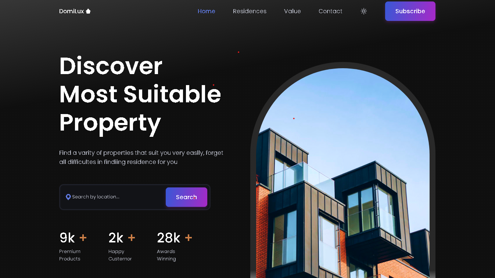
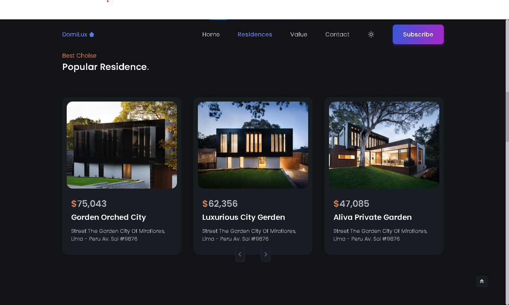

# DomiLux 🏘️ Real Estate Platform

## 🌐 Project Overview
DomiLux is a modern web application for exploring and showcasing luxury real estate properties, offering an intuitive, responsive platform for property enthusiasts and potential buyers.

## 🛠 Technologies
- HTML5
- CSS3
- JavaScript
- Responsive Web Design

## 🚀 Features
- Interactive property listings
- Detailed property information
- Advanced search functionality
- Responsive mobile-first design
- High-performance user interface

## 📦 Installation Methods

### Direct Download
1. Visit GitHub Repository
2. Click "Code" button
3. Select "Download ZIP"
4. Extract files locally

### Git Clone
```bash
# HTTPS
git clone https://github.com/LechehebDjaafar/web-DomiLux.git
cd web-DomiLux
```

## 🔧 Development Setup

### Local Development
1. Clone repository
2. Open project directory
3. Launch `index.html` in browser


## 🤝 Contribution Guidelines

### Workflow
1. Fork Repository
2. Create Feature Branch
   ```bash
   git checkout -b feature/your-feature-name
   ```
3. Commit Changes
   ```bash
   git commit -m "Add detailed description of changes"
   ```
4. Push to Branch
   ```bash
   git push origin feature/your-feature-name
   ```
5. Open Pull Request

### Code Standards
- Follow HTML5, CSS3 semantic standards
- Maintain responsive design principles
- Write clean, commented JavaScript
- Ensure cross-browser compatibility

## 🎥 Project Demo
[](https://youtu.be/lNXqM7zd3NA)
## 📸 Screenshots




## 🔒 Security
- Implement input validation
- Secure API endpoints
- Follow OWASP guidelines

## 📊 Performance Optimization
- Minimize HTTP requests
- Compress images
- Implement lazy loading
- Use efficient CSS and JavaScript

## 📞 Contact
- GitHub: [Lecheheb Djaafar](https://github.com/LechehebDjaafar)
- Youtube: [CodeCraftDL](https://www.youtube.com/@CodeCraftDL)
## 📄 License
MIT License - Open-source project

## 🌟 Acknowledgments
Thanks to all contributors and open-source community
